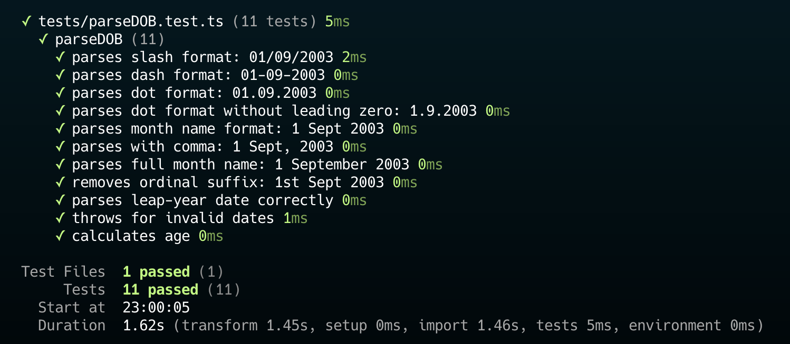

# dobx

A small mordern TypeScript-first utility for parsing dates of birth

- `dob` → "Date of Birth"
- `x` → extension / utility / modern tool

`dobx` provides strong typing, multi-format parsing and accurate age plus leap year detecton. Perfect for authentication flows, signup forms, profiles and DOB validation

## Features

- ✔ Supports multiple DOB formats:

  - `DD/MM/YYYY`
  - `DD-MM-YYYY`
  - `DD.MM.YYYY`
  - `1st Jan 2000`
  - `01 January 2000`
  - `1 Jan, 2000`

- ✔ Fully type-safe with a strict `DOBString` union type
  - `DOBString` enforces type safety and allows only valid date formats
- ✔ Extracts day, month, year
- ✔ Converts to a real JavaScript `Date`
- ✔ Detects leap year
- ✔ Calculates accurate age
- ✔ Lightweight and dependency-free
- ✔ Written in modern TypeScript

## Installation

```bash
npm install dobx
# or
pnpm add dobx
#or
yarn add dobx
```

## Usage

### JavaScript Example

```js
import { parseDOB } from "dobx";

const dob = parseDOB("01/09/2003");

console.log(dob);
/*
{
  day: 1,
  month: 9,
  year: 2003,
  date: 2003-09-01T00:00:00.000Z,
  isLeapYear: false,
  age: 22
}
*/
```

### TypeScript Example (Type-Safe)

```ts
import { parseDOB, type DOBInfo, type DOBString } from "dobx";

const input: DOBString = "1st Sept 2003";

const dob: DOBInfo = parseDOB(input);

console.log(dob.age);
```

### Example: Leap Year Handling

```ts
import { parseDOB } from "dobx";

const dob = parseDOB("29/02/2000");

console.log(dob.isLeapYear); // true
console.log(dob.age);
```

## API

`parseDOB(dob: DOBString): DOBInfo`

Returns:

| Property     | Type    | Description                              |
| ------------ | ------- | ---------------------------------------- |
| `day`        | number  | Day of month (1–31)                      |
| `month`      | number  | Month number (1–12)                      |
| `year`       | number  | Full year (e.g., 2000)                   |
| `date`       | `Date`  | Native JavaScript Date                   |
| `isLeapYear` | boolean | Whether the provided year is a leap year |
| `age`        | number  | Age calculated from today                |

## Test Result



## License

MIT © [thelastofinusa](https://linktr.ee/thelastofinusa)
